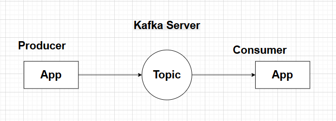

# Kafka (MOM)

## What is Kafka?
Kafka is a distributed streaming platform that allows you to publish and subscribe to streams of records, similar to a message queue or enterprise messaging system. It is designed to handle **high-throughput**, **fault-tolerant**, and **scalable data streaming** applications.

### 1. Producer:
- Send the Data to the Kafka topic.
- choose the partition to which the message should be sent.
- Producer don't care about the consumer, it just sends the data to the topic.

### 2. Topic:
- A topic is a category or feed name to which messages are published.
- Topics are partitioned, and each partition is an ordered, immutable sequence of messages that is continually appended to.

### 3. Partition
- Physical storage unit for a topic.
- Each partition is an ordered, immutable sequence of messages that is continually appended to.

### 4. Consumer:
- Subscribe to the topic and consume the messages.
- Consumers can be part of a consumer group, which allows for load balancing and fault tolerance.

### 5. Consumer Group:
- A consumer group is a group of consumers that work together to consume messages from a topic.
- One partition can be consumed by only one consumer in a consumer group, which allows for load balancing and fault tolerance.

### 6. Broker:
- A Kafka cluster consists of multiple brokers, which are responsible for storing and managing the data.
- Each broker can handle multiple partitions and topics.
- Brokers communicate with each other to ensure data replication and fault tolerance.

### 7. Cluster:
- A Kafka cluster consists of multiple brokers that work together to provide high availability and fault tolerance.

### 8. Zookeeper:
- Kafka uses Zookeeper to manage the cluster and maintain the state of the brokers and topics.
- Zookeeper is responsible for leader election, configuration management, and maintaining the metadata of the cluster.
- 