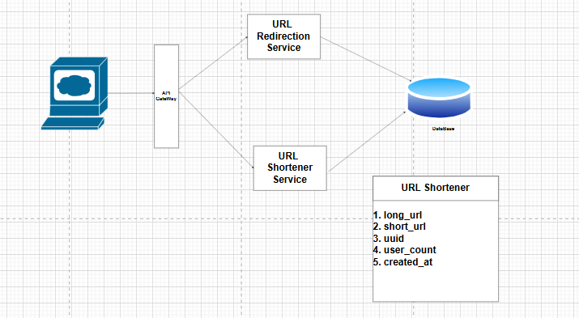
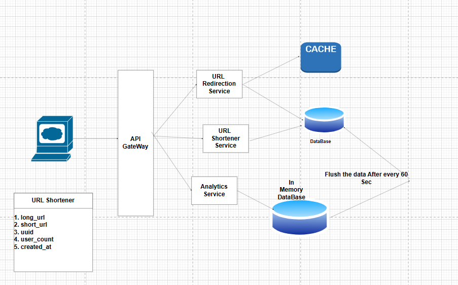

# Design URL Shortener

## Problem Statement
Design a URL shortening service like TinyURL. The service should provide the following functionalities:

### Requirement Gathering
1. FunctionRequirements:
   - Shorten a long URL to a short URL.
   - Redirect a short URL to the original long URL.
   - Track the number of clicks for each short URL.
2. Non-Functional Requirements:
   - The service should be highly available and scalable.
   - The service should have low latency for URL redirection.
   - 1B requests per day
   - 100 Million Daily Active user
   - 1- 5B total Lifetime urls

### API Design
1. Shorten URL API
   - Endpoint: POST /shorten
   - Request Body: { "longUrl": "https://www.example.com" }
   - Response Body: { "shortUrl": "http://short.url/abc123" }
2. Redirect URL API
   - Endpoint: GET /{shortUrlId}
   - Response: Redirects to the original long URL
   

### Basic HLD Design

### Better HLD Design

### URLs Shortening Algorithm
1. **Base62 Encoding:** Use a combination of uppercase letters, lowercase letters, and digits to create a unique short URL ID.
   1. Create a counter and increment it for each new URL.: But drawback is that it can be easily guessed and can lead to security issues. and there is single point of failure.
   2. Use a Random String Generator: Generate a random string of a fixed length (e.g., 6 characters) for each new URL. This approach is more secure and less predictable than using a counter.
   3. Use a Hashing Algorithm: Hash the long URL to create a unique short URL ID. This approach can help avoid collisions and can be more efficient for large datasets.

### Final HLD Design
