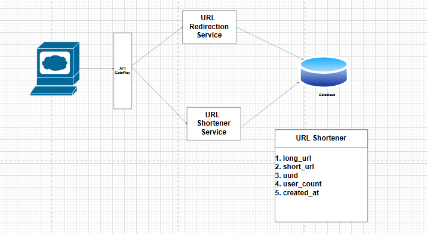
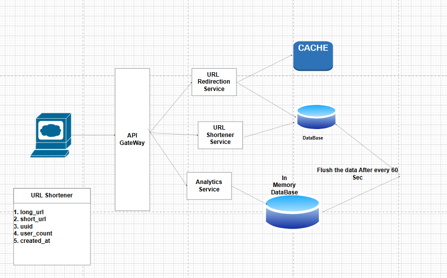

# Design URL Shortener

## Problem Statement
Design a URL shortening service like TinyURL. The service should provide the following functionalities:

### Requirement Gathering
1. FunctionRequirements:
   - Shorten a long URL to a short URL.
   - Redirect a short URL to the original long URL.
   - Track the number of clicks for each short URL.
2. Non-Functional Requirements:
   - The service should be highly available and scalable.
   - The service should have low latency for URL redirection.
   - 1B requests per day
   - 100 Million Daily Active user
   - 1- 5B total Lifetime urls

### API Design
1. Shorten URL API
   - Endpoint: POST /shorten
   - Request Body: { "longUrl": "https://www.example.com" }
   - Response Body: { "shortUrl": "http://short.url/abc123" }
2. Redirect URL API
   - Endpoint: GET /{shortUrlId}
   - Response: Redirects to the original long URL
   

### Basic HLD Design


### Better HLD Design



### URLs Shortening Algorithm
1. **Base62 Encoding:** Use a combination of uppercase letters, lowercase letters, and digits to create a unique short URL ID.
   1. Create a counter and increment it for each new URL.: But drawback is that it can be easily guessed and can lead to security issues. and there is single point of failure.
   2. Use a Random String Generator: Generate a random string of a fixed length (e.g., 6 characters) for each new URL. This approach is more secure and less predictable than using a counter.
   3. Use a Hashing Algorithm: Hash the long URL to create a unique short URL ID. This approach can help avoid collisions and can be more efficient for large datasets.

### Final HLD Design



## Production-Grade Deep Dives & Edge Cases

### Data Layer: Why NoSQL Wins at Scale
While a sharded SQL instance can technically contain 3.3 TB of data, a **NoSQL Key-Value or Document Store (e.g., AWS DynamoDB or Apache Cassandra)** is explicitly selected for this architecture:
* **No Relationships:** A URL shortener represents an isolated key-value mapping (`short_slug -> long_url`). Relational constraints, joins, and ACID-transaction engines add unnecessary computing overhead.
* **Consistent $O(1)$ Operations:** NoSQL databases partition rows by a hash function executed on the Partition Key (`short_slug`). As the cluster scales horizontally from 10 nodes to 100 nodes, lookup times stay perfectly flat.

#### Handling Custom Aliases with Conditional Writes
Custom links do not follow the sequence derived from the Global Counter. This creates a race condition vulnerability if two separate users attempt to register the exact same alias (e.g., `elonmusk`) at the identical microsecond. 

To resolve this without distributed locks on the write path, we leverage **Atomic Conditional Writes** native to NoSQL storage engines:
```text
PutItem(
  TableName: "URL_Mapping",
  Item: {
    "short_slug": "elonmusk",
    "long_url": "[https://twitter.com/elonmusk](https://twitter.com/elonmusk)",
    "created_at": 1774391200
  },
  ConditionExpression: "attribute_not_exists(short_slug)"
)
```
The storage engine handles the execution atomicity. The first query to hit the data node wins. The second concurrent query is rejected with a ConditionalCheckFailedException, which the Write Server handles by returning a 409 Conflict (Alias Already Taken) response to the user.Resilience Strategy: Mitigating the Cache StampedeIf a highly public, viral link (generating 50,000 requests/sec) drops from the Redis cluster due to cache expiration or node eviction, all 50,000 simultaneous connections instantly cascade downward onto the persistent NoSQL database layer. This Cache Stampede (Thundering Herd) will over-utilize database IOPS and cause system-wide brownouts.We mitigate this inside the Read Server application logic by implementing Distributed Mutex Locking (via Redis SetNX):Pythondef get_long_url(short_slug):
    # Attempt high-speed cache read
    long_url = redis.get(short_slug)
    if long_url is not None:
        return long_url # Cache Hit

    # Cache Miss: Protect database from stampede using an atomic lock
    lock_key = f"lock:{short_slug}"
    
    # Try to set lock with 2-second expiration (NX = Only set if not exists)
    if redis.set(lock_key, "locked", nx=True, ex=2):
        try:
            # Double-check cache in case another parallel thread just built it
            long_url = redis.get(short_slug)
            if long_url is not None:
                return long_url
                
            # Single query allowed to execute against persistent storage
            long_url = db.query_long_url(short_slug)
            
            # Write back to Redis to unblock all queued/future readers
            redis.set(short_slug, long_url, ex=86400) # 24-hour TTL
            return long_url
        finally:
            redis.delete(lock_key) # Clean up lock
    else:
        # Lock acquisition failed - another process is active on the DB read
        # Back off and poll cache again after brief sleep
        time.sleep(0.05) # 50 milliseconds
        return get_long_url(short_slug)
URL Expiration & Cleanup LifecycleScanning an active, 6-billion-row production database to locate and prune expired links introduces massive disk I/O contention. We use a hybrid Lazy-Plus-Asynchronous cleanup strategy:Lazy Deletion: When a short link is read, the system checks the expire_at attribute. If the current system epoch exceeds expire_at, a 404 Not Found code is sent to the user, and an asynchronous delete signal is queued.Segmented Batch Sweeper: A background cron service scans a secondary partition index grouped by month/day of expiration. It runs continuously at low priority, deleting expired records in small, isolated batches (e.g., 1,000 rows per transaction). This distributes database cleaning overhead evenly across 24 hours, keeping database performance stable.6. High-Level Summary MatrixMetric / LayerComponent SelectionCore JustificationApp ArchitectureCQRS (Independent Pools)Isolates critical high-traffic reads from compute-heavy writes.Token SourcingCounter + KGS (ZooKeeper)Complete avoidance of runtime hash collisions, guaranteeing $O(1)$ writes.Data StrategyNoSQL (DynamoDB / Cassandra)Horizontal scalability, automated auto-sharding, high performance for simple keys.Caching LayerDistributed Redis ClusterHolds daily active $20\%$ hot links in-memory (~38GB) for sub-10ms performance.Concurrency RuleConditional Writes / Mutex LocksFully blocks race conditions on custom creation and prevents cache stampedes on failure.
