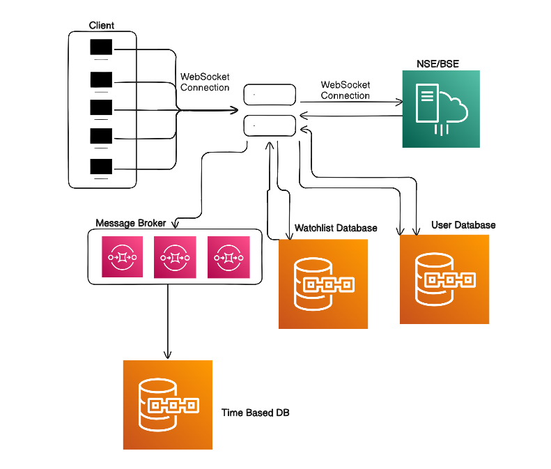
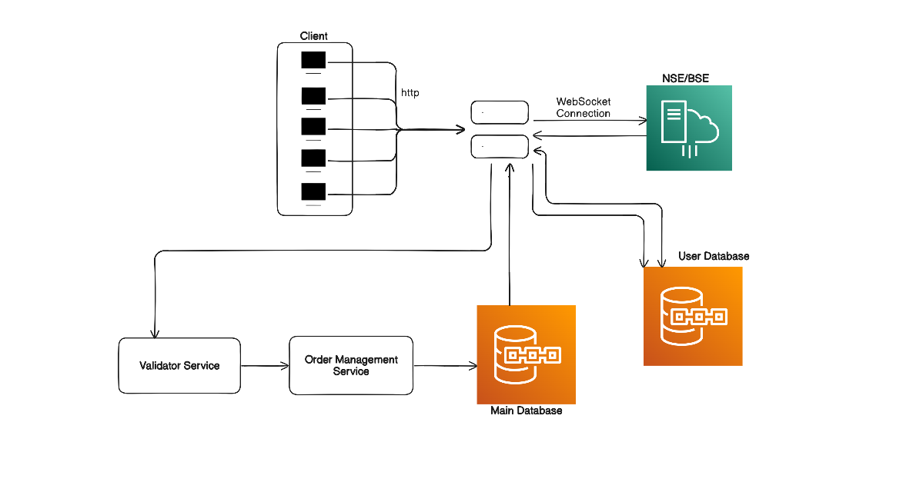
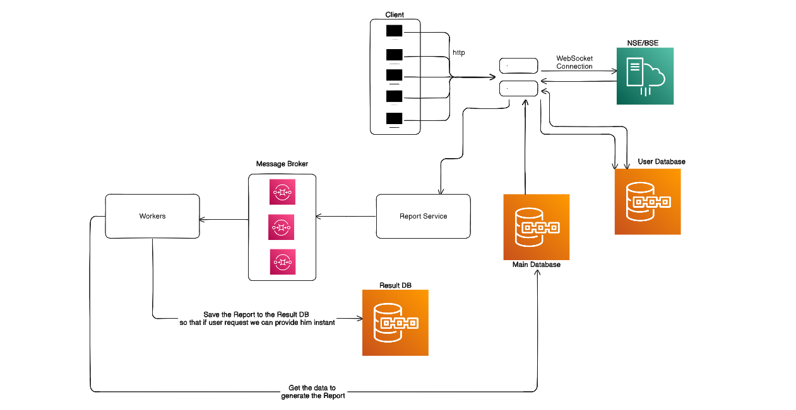

# Zarodha Stock Exchange System Design

Here we will be design a stock exchange system like Zarodha. The system should provide the following functionalities:
1. Watchlist: Users can create a watchlist of stocks they are interested in and receive real-time updates on their prices.
2. Buy/Sell Stocks: Users can place buy and sell orders for stocks, which will be executed based on market conditions.
3. Portfolio Management: Users can view their portfolio of stocks, including the current value and performance

## 1. Watchlist:
   - Users can create a watchlist of stocks they are interested in and receive real-time updates on their prices.
   - The system will use WebSockets to provide real-time updates to users about stock prices and market conditions.

1. Why Websocket not HTTP for real-time updates?
   - WebSockets provide a full-duplex communication channel over a single TCP connection, allowing for real-time updates without the need for constant polling, which can be inefficient and lead to increased latency.
   - IF we are using HTTP it requires TCP connection to be established for each request, which can lead to increased latency and overhead, especially in scenarios where frequent updates are required.

2. Time Based Database for Storing Stock Prices:
   - We can use a time-based database like InfluxDB or TimescaleDB to store historical stock price data. These databases are optimized for handling time-series data and can efficiently store and query large volumes of stock price data over time.
   - We are not using a traditional relational database for storing stock prices because they may not be optimized for handling time-series data and may not provide the necessary performance and scalability for real-time updates and historical data analysis.

## 2. Buy/Sell Stocks:
   - Users can place buy and sell orders for stocks, which will be executed based on market conditions.

## 3. Portfolio Management:
- User can generate their P&L report, which will show the profit and loss for each stock in their portfolio based on the current market price and the price at which they bought the stock.

Why we are using message queue for Report Generation?
- Report generation can be a resource-intensive process, especially if it involves complex calculations and data aggregation. By using a message queue, we can offload the report generation task to a separate worker process, allowing the main application to remain responsive and handle other user requests without being blocked by the report generation process. This can help improve the overall performance and scalability of the system, especially when dealing with a large number of users and complex report generation requirements.